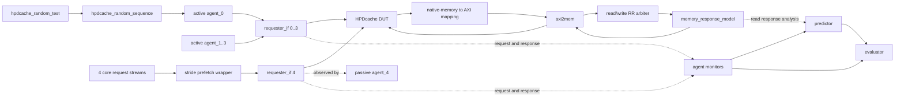

# HPDcache UVM 验证架构

> 文档基线：2026-09-03，以当前仓库源码为准。

## 1. 目标与范围

当前环境是面向 CVA6 固定配置的 HPDcache 黑盒 UVM 验证环境。验证侧只通过
requester 接口和下游 memory 接口观察 DUT，不依赖 DUT 内部实现。

当前已经打通的主数据路径为：

```text
sequence -> requester agent -> HPDcache -> AXI adapter
         -> cv_dv_utils memory model -> HPDcache response -> scoreboard
```

本阶段支持 cacheable、physical-indexed 的普通 `LOAD`/`STORE` 请求及数据一致性
检查。AMO、CMO、主动预取、错误注入、memory backpressure、功能覆盖率、性能统计
和自定义 SVA 尚未实现。

## 2. 固定 DUT 配置

配置定义在 `config/hpdcache_cva6_config_pkg.sv`，类型由
`testbench/common/hpdcache_cva6_types_pkg.sv` 生成。

| 配置项 | 当前值 | 说明 |
| --- | ---: | --- |
| PA width | 56 bit | requester 物理地址宽度 |
| Sets / Ways | 256 / 8 | 8-way set associative |
| Cache line | 2 x 64 bit = 16 byte | 总容量 32 KiB |
| Request width | 1 x 64 bit | 每个 core request 传输 8 byte |
| Requesters | 5 | 4 个 core requester + 1 个 prefetch requester |
| SID / TID width | 3 / 3 bit | 每个 active requester 最多分配 8 个 TID |
| Memory addr/data/ID | 64 / 64 / 4 bit | 下游 memory 侧参数 |
| Write policy | WB enabled, WT disabled | 默认 write-back |
| Victim selection | Random | `HPDCACHE_VICTIM_RANDOM` |
| MSHR | 1 set x 8 ways | 最多 8 个 MSHR entry |
| WBUF directory/data | 7 / 7 entries | write buffer 配置 |
| RTAB | 4 entries | replay table 配置 |
| Low latency | Enabled | refill response feedthrough 同样开启 |
| ECC / scrubber | Disabled | 当前不验证 ECC 路径 |

## 3. 顶层拓扑

### 3.1 HDL 与 UVM 数据流



`top.sv` 保留 CVA6 的五 requester 拓扑：

- `requester_if[0:3]` 由四个 active requester agent 驱动并监控。
- `requester_if[4]` 连接真实的 stride-prefetch wrapper，仅由 passive agent 监控。
- prefetch wrapper 会 snoop 前四个 requester 的已接受请求，但所有 prefetch CSR
  输入固定为 0，因此当前不会产生主动预取流量。
- DUT 的 native read/write memory channel 在顶层映射到 AXI，再由 `axi2mem` 接入
  `memory_response_model`。read/write 请求通过一个 2-input round-robin arbiter 共用
  同一份 backing memory。

### 3.2 UVM 组件树

```text
uvm_test_top (hpdcache_random_test)
`-- env (hpdcache_env)
    |-- clock_driver
    |-- hpdcache_reset_driver
    |-- agent_0 .. agent_3 (active)
    |   |-- sequencer
    |   |-- driver
    |   `-- monitor
    |-- agent_4 (passive)
    |   `-- monitor
    |-- axi2mem_req
    |-- mem_rsp_model
    `-- scoreboard
        |-- predictor
        |   `-- reference_model
        `-- evaluator
```

空的 `testbench/dram_agent/` 文件目前只是占位符，不参与编译或组件树。

## 4. 核心组件职责

| 组件 | 职责 |
| --- | --- |
| `hpdcache_item` | 表示 requester request/response；携带 op、地址、数据、BE、size、SID、TID、error 和期望数据有效位 |
| `hpdcache_agent_config` | 保存 active/passive 属性、requester ID，以及该 requester 独占的 TID manager |
| `hpdcache_tid_manager` | 用容量为 8 的 mailbox 原子分配/回收 TID，阻止 outstanding TID 重用 |
| `hpdcache_sequencer` | 仲裁 sequence，并直接向 sequence 暴露本 agent 的 config |
| `hpdcache_driver` | 驱动 valid/ready request，跟踪已接受请求，根据 SID/TID 把 response 路由回原 sequence |
| `hpdcache_monitor` | 采集已握手 request 和所有 valid response，并检查端口编号与 SID 一致 |
| `hpdcache_predictor` | 根据 request 和下游 memory read response 构造 expected response |
| `hpdcache_reference_model` | 维护 byte-valid 的稀疏 shadow memory |
| `hpdcache_evaluator` | 按 `{SID,TID}` 排队匹配 actual/expected response，检查 error 和 load data |
| `hpdcache_scoreboard` | 封装 predictor/evaluator，并对外提供 request、actual、memory-response analysis export |
| `hpdcache_env` | 创建/连接所有组件，配置 clock/reset/memory model，并提供 drain 判断 |
| `hpdcache_base_test` | 在 `main_phase` 统一管理 objection，启动激励并等待环境 drain |

## 5. Transaction 与激励约束

`hpdcache_item` 中 `op`、`addr`、`data`、`be` 和 `size` 为随机字段；`sid` 和
`tid` 由基础 sequence 在发送前分配。当前默认约束为：

| 字段 | 当前约束 |
| --- | --- |
| `op` | `HPDCACHE_REQ_LOAD` 或 `HPDCACHE_REQ_STORE` |
| `addr` | `0x00000080000000` 到 `0x00000080000ff8` |
| Alignment | `addr[2:0] == 0`，8-byte 对齐 |
| `size` | `3`，即 8 byte |
| `be` | 全 1，全字写使能 |
| `data` | 无额外约束，随机值 |

driver 还会固定以下接口属性：

- `need_rsp = 1`
- `phys_indexed = 1`
- `req_abort = 0`
- `pma.uncacheable = 0`
- `pma.io = 0`
- `pma.wr_policy_hint = HPDCACHE_WR_POLICY_AUTO`

因此当前激励只覆盖 cacheable、不可 abort 的普通全字访问。

## 6. Request/Response 生命周期

1. `hpdcache_base_sequence::pre_start()` 从目标 sequencer 获取 agent config。
2. `begin_request()` 从该 agent 的 TID manager 阻塞式获取空闲 TID，并写入当前
   requester 的 SID。
3. driver 通过 `seq_item_port.get()` 接收并 clone request，保持 `req_valid`，直到
   DUT 的 `req_ready` 完成握手。
4. 已握手 request 被放入 driver 的 `outstanding_requests[tid]`。driver 随后可继续
   接收新 request，因此接口上同一时刻只驱动一笔 request，但允许多笔 response
   outstanding。
5. response 到达时，driver 检查 SID 和 TID，使用 `set_id_info()` 保留 UVM
   sequence routing 信息，再通过 `seq_item_port.put()` 返回 originating sequence。
6. sequence 的 response handler 回收 TID；`post_start()` 会等待本 sequence 的全部
   outstanding TID 回收后才退出。

TID manager 是 per-agent 实例，SID 区分 requester，因此 scoreboard 和 driver 都以
`{SID,TID}` 作为协议 transaction key。

## 7. Scoreboard 数据检查

所有 requester monitor 的同一个 analysis stream 同时连接到 predictor 和 evaluator：

- predictor 只消费 request。
- evaluator 只消费 response，作为 actual transaction。
- predictor 生成 expected transaction 后发送给 evaluator。

reference model 使用下游 memory word 地址索引稀疏表，每个 byte 单独维护 valid：

- 观察到 `STORE` request 时，按 BE 立即更新 shadow memory；store expected response
  可立即进入 evaluator。
- 观察到 `LOAD` request 时，只读取 shadow memory 中已经 known 的 byte。
- 若 cold load 数据尚未知，expected response 暂存在 predictor。无错误的下游
  memory read response 会补充未知 byte；所有被请求 byte 均 known 后才发布 expected。
- 下游 refill 不覆盖已经被已观察 store 更新过的 byte。

predictor 和 evaluator 都为每个 `{SID,TID}` 保存 FIFO，以维持同一个 key 被复用时的
请求顺序。比较规则如下：

- 任意 actual response 的 `error=1` 均报 `UVM_ERROR`。
- load 对每个 `data_valid=1` 的 byte 做四态严格比较。
- store 当前只检查 response 存在、key 匹配且无 error，不比较 response data。
- `check_phase` 报告所有 unresolved prediction、unmatched actual 或 unmatched expected。

## 8. Clock、Reset 与结束机制

- `clock_driver` 固定配置为 100 MHz、50% duty cycle、初始低电平。
- clock/reset 由 `core-v-verif` 的 `cv_dv_utils` 组件提供。
- requester driver/monitor 是常驻 `run_phase` 服务；导入的 `axi2mem` worker 使用
  `main_phase`。
- 只有 base test 在 `main_phase` raise/drop objection，agent、driver、monitor 和
  scoreboard 均不自行控制 objection。
- sequence 完成后，base test 最多等待 10 us，直到所有 active driver、所有 TID
  manager、predictor 和 evaluator 均 idle。
- 顶层另有 50 us 全局仿真超时保护。

signal-level reset 期间，driver 驱动 idle，并为已经接收的请求返回 error response，
使仍存活的 sequence 能释放 TID。若进入 UVM `reset_phase`，agent 会停止旧 sequence、
清空 driver 状态并重建 TID pool；predictor/evaluator 同时清除 pending 状态，reference
model 清空 golden memory。

## 9. Memory Model 配置

当前 `memory_response_model` 设置为：

| 属性 | 当前值 |
| --- | --- |
| Enable | `1` |
| Response order | `IN_ORDER_RSP` |
| Response mode | `ZERO_DELAY_RSP` |
| Inter-data delay | `0` cycle |
| Backpressure | `NEVER` |
| Read/write/AMO error injection | Disabled |
| Exclusive failure injection | Disabled |
| Unsolicited response | Disabled |

这一配置适合基础连通性和功能 smoke，不覆盖延迟、乱序、阻塞及错误恢复。

## 10. 编译与运行

环境使用 Questa 和 UVM 1.2；依赖顺序集中在 `testbench/hpdcache_uvm.f`。

```sh
export QUESTA_HOME=/path/to/modeltech
make random
```

输出位于 `build/questa/`。`Makefile` 会执行 compile、optimize、simulation，并在 log
中检测非零 `UVM_ERROR`/`UVM_FATAL` summary。

## 11. 当前实现边界

以下能力尚未落地，不能视为当前架构已经覆盖：

- directed sequence、长随机流量和 virtual sequence
- requester 1 到 3 的主动并发激励
- active stride prefetch 配置与检查
- partial/unaligned access、uncacheable/IO、abort
- AMO、CMO、flush、invalidation
- memory delay、out-of-order、backpressure、error injection
- hit/miss/eviction/writeback 等内部事件采集
- functional coverage、code coverage、性能采样和自定义 SVA
- 多套 HPDcache 参数配置；当前仅支持固定 CVA6 配置
